# ** TrafficAnalysis.py**
# Real-time NYC Traffic Analysis with Apache Spark

## Features

### Data Fetching and Processing
- Fetches real-time NYC traffic data using the NYC Open Data API (https://data.cityofnewyork.us/resource/7ym2-wayt.json).
- Performs data preprocessing, including handling missing data, renaming columns for consistency, and creating new time-related features:
  - **Day of the Week**: Helps identify patterns like weekday vs. weekend traffic.
  - **Is Weekend**: A binary feature indicating whether a given day is a weekend.
  - **Week of the Year**: Captures traffic patterns over different weeks.
- Handles spatial data using geometry fields to extract coordinates if applicable.
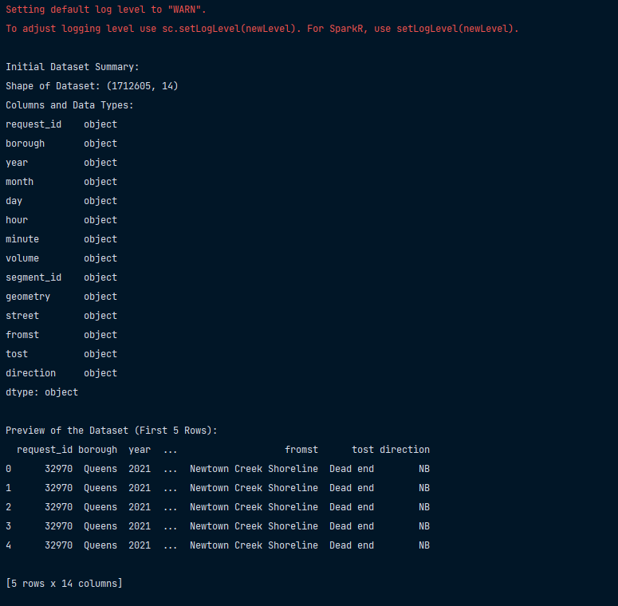
- 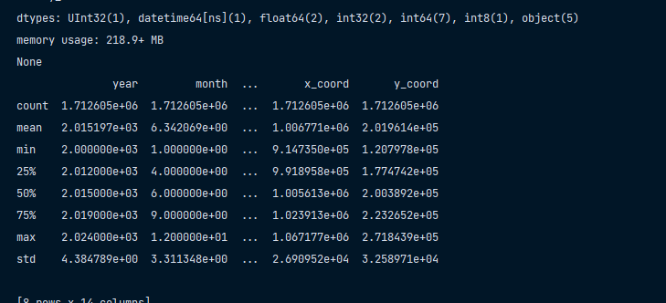
- 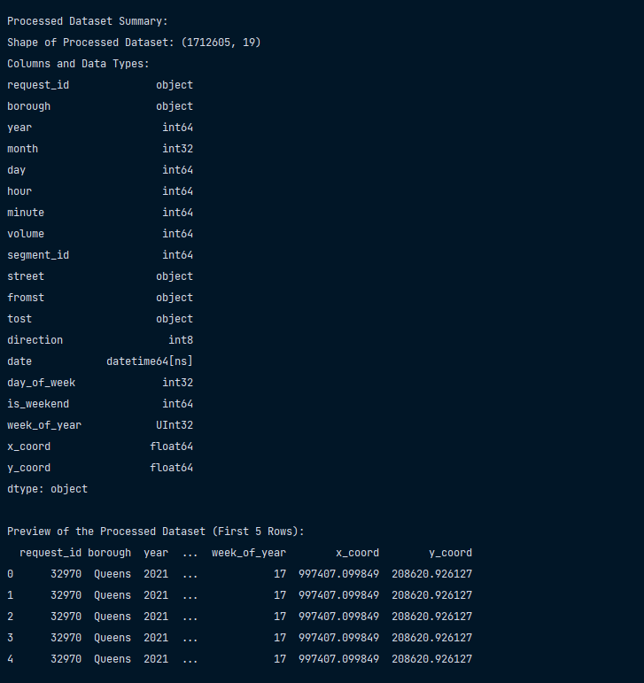
### Analyses and Visualizations

1. **Correlation Heatmap**  
   - **Purpose**: Shows how numeric features (e.g., traffic volume, hour, segment ID) are related to each other.  
   - **Output**: A heatmap visualization displaying correlations between variables. Helps understand the dependencies in the dataset.
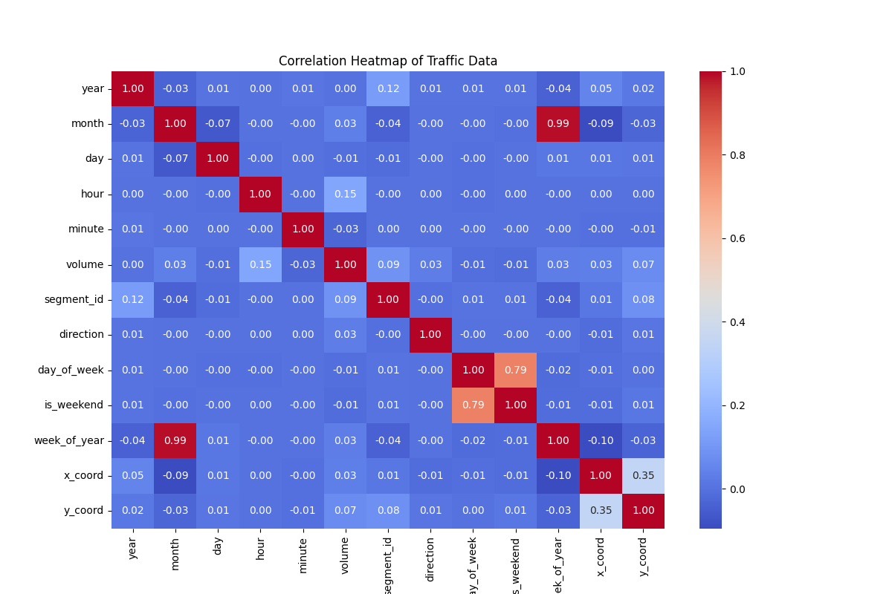
2. **Borough-Wise Traffic Volume Analysis**  
   - **Purpose**: Analyzes traffic volume across NYC's boroughs.  
   - **Method**: Aggregates total traffic volume per borough and visualizes it as a bar chart.  
   - **Insights**: Identifies which boroughs have the highest traffic and provides a breakdown of city-wide traffic patterns.
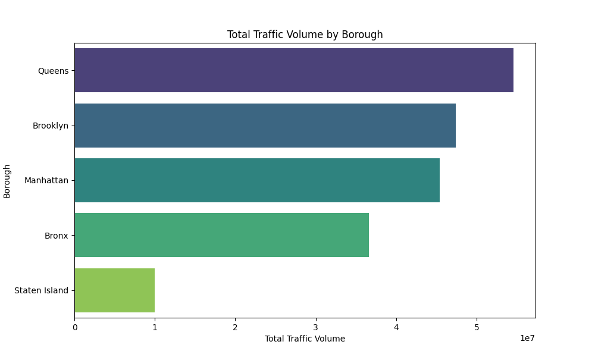
3. **Directional Traffic Volume Analysis**  
   - **Purpose**: Analyzes traffic flow in different directions (North, South, East, West).  
   - **Method**: Maps numeric direction codes to labels (e.g., North = 0, South = 1) and aggregates total volume for each direction.  
   - **Output**: A bar chart showing traffic volume distribution by direction.
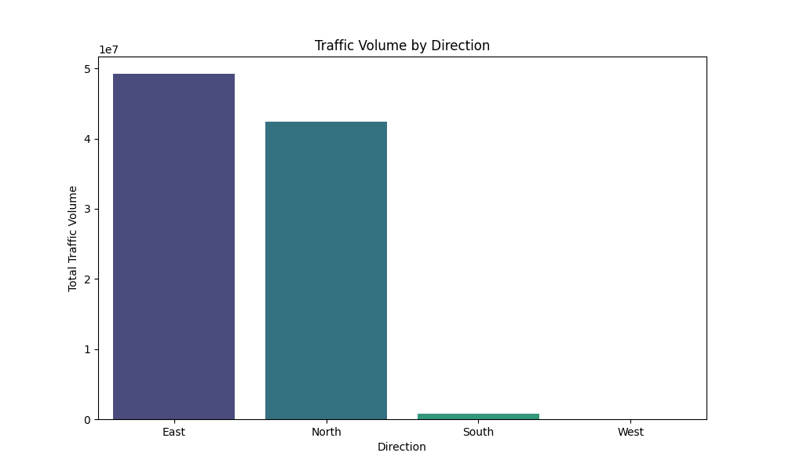
4. **Street-Wise Traffic Analysis**  
   - **Purpose**: Identifies the busiest streets in NYC.  
   - **Method**: Groups data by street name and calculates total and average traffic volumes.  
   - **Output**: A bar chart showcasing the top 10 busiest streets based on total traffic volume.
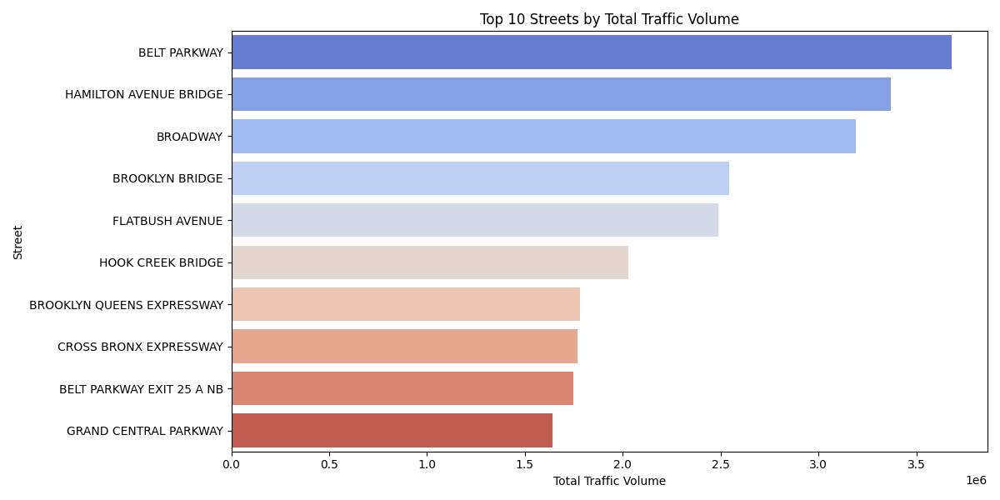
5. **Traffic Volume Over Time**  
   - **Purpose**: Tracks how traffic volume changes over days, weeks, and months.  
   - **Method**: Aggregates total traffic volume by date and visualizes it as a time-series plot.  
   - **Insights**: Helps identify trends, seasonality, or anomalies in traffic patterns.
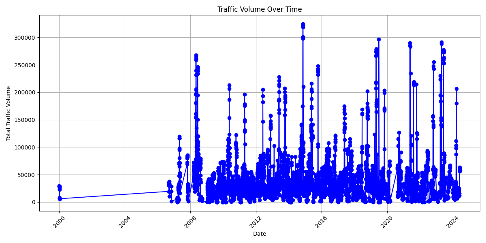
6. **Peak Hours Analysis**  
   - **Purpose**: Identifies the busiest hours of the day.  
   - **Method**: Groups data by hour of the day and aggregates traffic volume.  
   - **Output**: A line plot showing traffic trends throughout the day, helping pinpoint peak traffic hours.
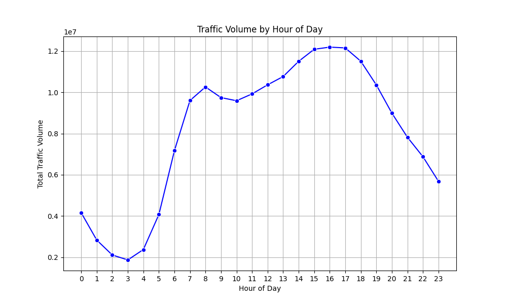
7. **Top 10 Busiest Dates**  
   - **Purpose**: Identifies specific days with the highest traffic volumes.  
   - **Method**: Aggregates total traffic by date, sorts it in descending order, and displays the top 10 dates.  
   - **Output**: A bar chart highlighting the busiest dates.
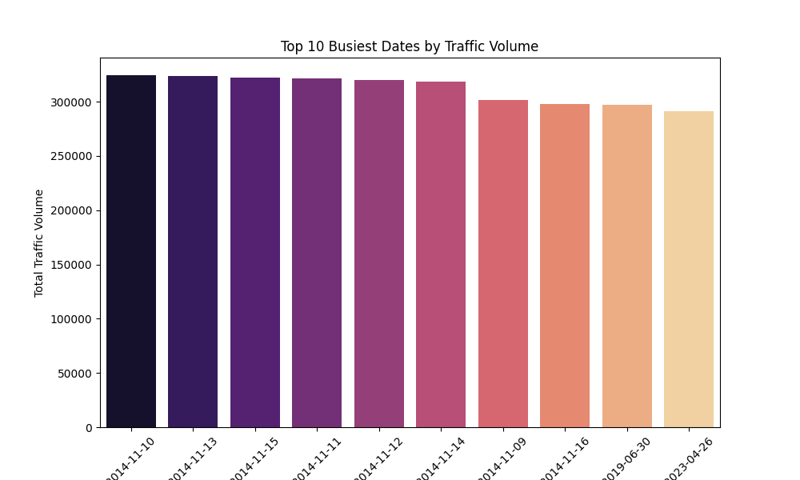
### Machine Learning Models

1. **Random Forest Regression for Traffic Volume Prediction**  
   - **Purpose**: Predicts traffic volume based on features like hour, segment ID, day of the week, and month.  
   - **Steps**:  
     - Splits data into training and testing sets.  
     - Fits a Random Forest Regressor to the training data.  
     - Evaluates model performance using metrics like Mean Squared Error (MSE) and R-squared (R²).  
   - **Visualization**:  
     - Scatter plot of actual vs. predicted traffic volume.  
     - Feature importance plot, showing the most influential variables.
.png)
2. **Traffic Volume Classification**  
   - **Purpose**: Classifies traffic volume into categories (Low, Medium, High).  
   - **Steps**:  
     - Bins traffic volume into predefined ranges.  
     - Encodes categorical features (e.g., borough, direction).  
     - Trains a Random Forest Classifier to predict traffic categories.  
   - **Evaluation**: Classification report with precision, recall, and F1 score.

3. **Peak Hour Classification**  
   - **Purpose**: Identifies whether a given hour qualifies as a "peak hour."  
   - **Steps**:  
     - Labels hours as peak or non-peak based on traffic volume thresholds.  
     - Trains a classifier to predict peak hours based on traffic patterns.

4. **Abnormal Traffic Detection**  
   - **Purpose**: Detects traffic anomalies using statistical thresholds (e.g., traffic volume exceeding 3 standard deviations).  
   - **Steps**:  
     - Flags abnormal traffic instances.  
     - Trains a classifier to predict whether traffic is abnormal.
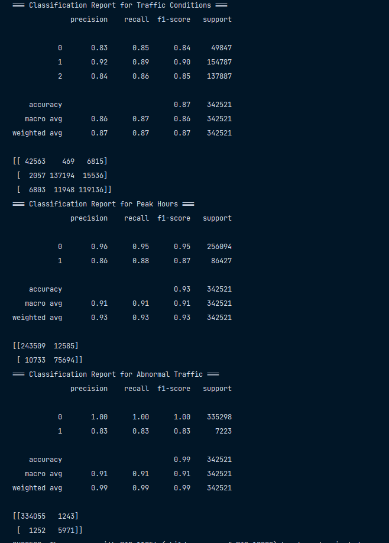

# ** Dash.py**
# Traffic Analysis Dashboard

## Features

- **Real-Time Updates**: Automatically fetches and updates traffic data every 10 seconds.
- **Interactive Visualizations**:
  - Traffic volume trends by street.
  - Top streets by traffic volume.
  - Hourly traffic volume distribution.
  - Borough-wise traffic distribution (pie chart and bar chart).
  - Geographical traffic map with markers.
- **Street Selector**: Filter visualizations by selecting a specific street.

## How It Works

### Data Pipeline

- **Data Source**:  
  The app fetches traffic data from the NYC Open Data API:  
  [NYC Traffic Data API](https://data.cityofnewyork.us/resource/7ym2-wayt.json)

- **Data Fetching**:  
  - Data is fetched in chunks using pagination (`$limit`, `$offset`).  
  - Filters are applied to fetch only traffic data from the year 2024.  

- **Data Processing**:  
  - Converts fields such as `year`, `month`, `day`, `hour`, and `volume` into numeric types.  
  - Extracts latitude and longitude from geographic data (`wktgeom`).  
  - Combines date and time components into a `datetime` column for time-series analysis.  

- **Real-Time Updates**:  
  A background thread continuously fetches and processes new data.  

---

## Dashboard Components

1. **Traffic Volume Trend Line Chart**  
   Displays traffic volume trends for a selected street over time.  
2. **Street Selector**  
   A dropdown to select specific streets and filter the visualizations.
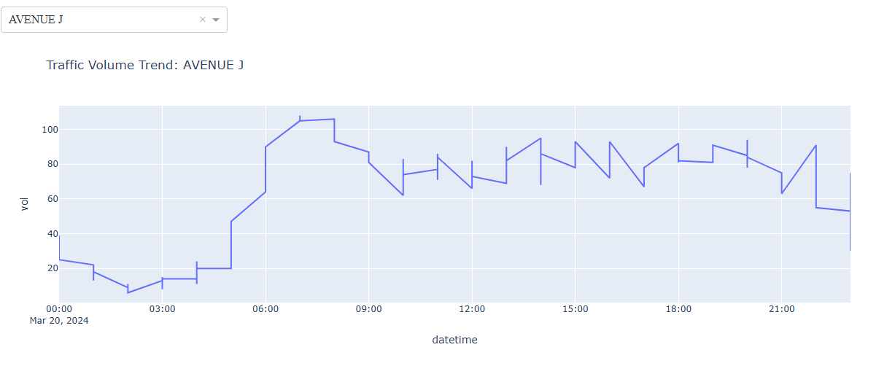
3. **Top 5 Streets by Traffic Volume**  
   A bar chart showing the streets with the highest traffic volume.
4. **Hourly Traffic Volume**  
   Bar chart showing traffic volume distribution across hours for the current day.  
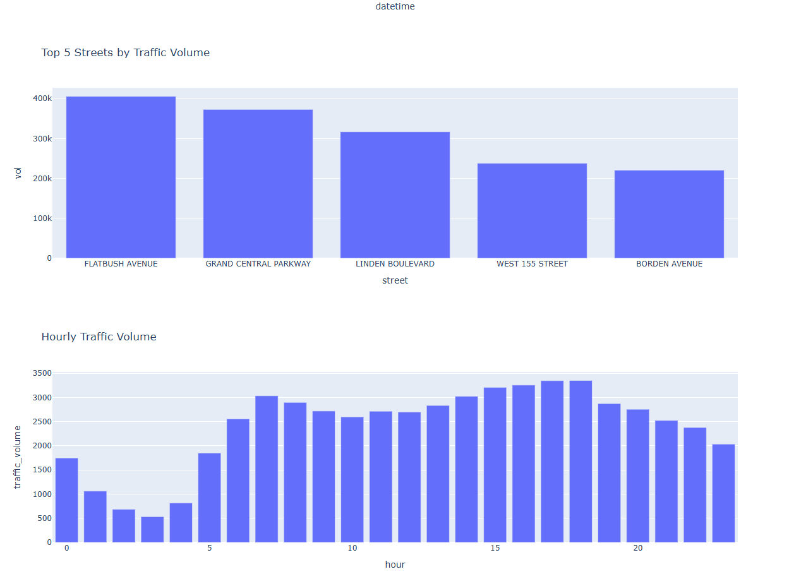
5. **Borough-Wise Traffic Volume (Pie and Bar Charts)**  
   Visualizes traffic distribution across boroughs using pie and bar charts.  
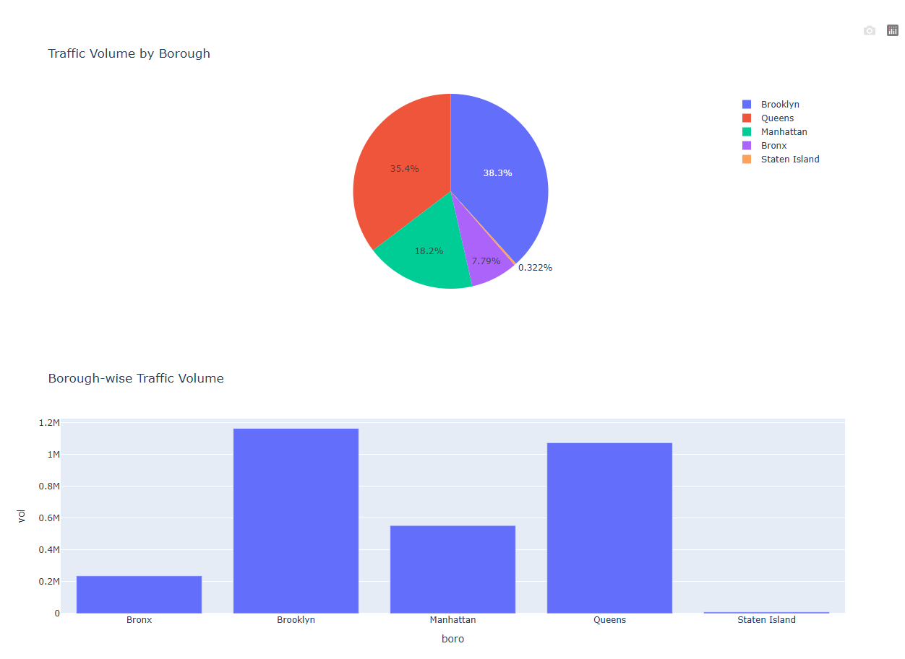
6. **Traffic Volume Map**  
   An interactive map showing traffic volumes geographically with markers.  
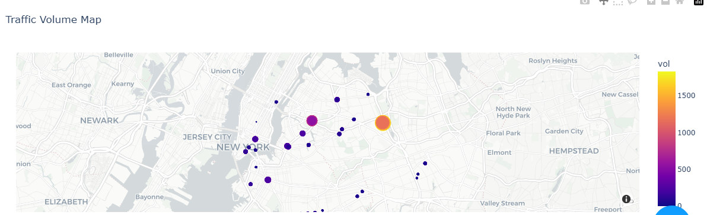

---

## Code Structure

### Key Components

- **Data Fetching**:  
  - `fetch_and_process_data()` fetches, processes, and structures the data.  

- **Background Thread**:  
  - A thread continuously updates the global dataset (`global_data`).  

- **Visualization Updates**:  
  - `update_graphs()` generates visualizations dynamically based on the selected street and updated data.  

### App Layout

The app layout consists of the following Dash components:  
- `dcc.Dropdown`: For street selection.  
- `dcc.Graph`: To render charts and maps.  
- `dcc.Interval`: For automatic updates.  

---

## Known Issues and Debugging

- **Missing Data**:  
  Rows without valid latitude or longitude are dropped.  

- **Performance**:  
  Large datasets may slow down the app. Future improvements can include data sampling or caching.  

- **Error Handling**:  
  Graceful fallback is implemented for empty or erroneous data.  

---

## Future Enhancements

- **Additional Visualizations**:  
  - Traffic heatmaps for hourly trends.  
  - Weekly or monthly trend comparisons.  

- **Predictive Modeling**:  
  - Implement traffic volume predictions using machine learning.  

- **Performance Optimization**:  
  - Introduce caching mechanisms for API calls.  

- **User Features**:  
  - Allow users to filter by borough, date range, and traffic direction.  
